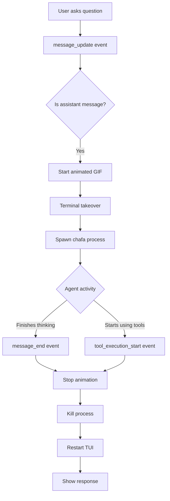

# Project Context: Thinking GIFs Extension for Pi Agent

## Overview

This is a **pi coding agent extension** that displays beautiful animated GIF visualizations while the agent is thinking. The extension provides visual feedback during AI processing using terminal graphics, making the wait time more engaging and fun.

**Repository:** dara-pi-agent-theme  
**Extension Name:** pi-thinking-gifs-extension  
**Current Version:** 2.0.0  
**Author:** Dara  
**License:** MIT

## Project Purpose

Enhance the pi coding agent user experience by:
1. Providing visual feedback when the AI is processing
2. Making wait times more engaging with animated graphics
3. Demonstrating pi's extension system capabilities
4. Creating a fun, personalized development environment (unicorn theme! 🦄)

## Architecture

### Technology Stack

- **Language:** TypeScript
- **Platform:** Node.js >= 18.0.0
- **Dependencies:**
  - `@mariozechner/pi-coding-agent` (peer dependency)
  - `@mariozechner/pi-tui` (peer dependency)
  - `chafa` >= 1.18.0 (system dependency - terminal graphics library)

### Core Components

1. **Extension Entry Point** (`extensions/thinking-gifs/index.ts`)
   - Main extension implementation
   - Event handlers for pi lifecycle
   - GIF rendering and display logic
   - Command registration

2. **GIF Assets** (`gifs/`)
   - Collection of GIF files
   - Currently: unicorn-themed animations
   - Randomly selected for variety

3. **Documentation** (Multiple markdown files)
   - User guides
   - Implementation details
   - Version history
   - Troubleshooting guides

## Key Features

### 1. Automatic Animated Display (v2.0+)
**When:** Agent starts thinking  
**What:** Terminal takeover with fully animated GIF  
**How:** 
- Hooks into `message_update` event (assistant role)
- Spawns chafa process in background
- Shows animated GIF until thinking completes
- Automatically stops and returns to pi

**Technical Pattern:**
```typescript
// 1. Detect thinking start
pi.on("message_update", async (event, ctx) => {
  if (event.message.role === "assistant" && !isThinking) {
    isThinking = true;
    await startAnimatedGif(ctx);
  }
});

// 2. Take over terminal
await ctx.ui.custom((tui, _, __, done) => {
  tui.stop();  // Release terminal
  animationProcess = spawn(shell, ["-c", chafaCommand], {
    stdio: "inherit"  // Direct terminal access
  });
  // Store references for later cleanup
});

// 3. Cleanup on completion
pi.on("message_end", async (event, ctx) => {
  if (isThinking) {
    isThinking = false;
    stopAnimatedGif();  // Kill process, restart TUI
  }
});
```

### 2. Manual Test Command
**Command:** `/thinking-gif`  
**What:** Displays animated GIF for testing (30-second timeout)  
**Use Case:** Testing GIF collection, demonstrating functionality

### 3. Random GIF Selection
- Scans `gifs/` directory for .gif files
- Randomly selects one each time
- Easy to expand collection (just add more GIFs)

## Display Modes

### Mode 1: Automatic Animation (Primary Feature)
- **Trigger:** Agent starts thinking
- **Display:** Full-screen animated GIF
- **Method:** Terminal takeover using `spawn()` + `stdio: 'inherit'`
- **Exit:** Automatic when agent finishes or starts using tools
- **User Experience:** Immersive, engaging visual feedback

### Mode 2: Manual Testing
- **Trigger:** `/thinking-gif` command
- **Display:** Full-screen animated GIF
- **Method:** Same as automatic mode
- **Exit:** Auto-stops after 30 seconds OR Ctrl+C
- **User Experience:** Test/preview functionality

## Technical Patterns

### Terminal Takeover Pattern
Based on pi's `interactive-shell.ts` extension example:

```typescript
// Stop pi's TUI
tui.stop();

// Clear screen
process.stdout.write("\x1b[2J\x1b[H");

// Run subprocess with full terminal control
spawnSync(shell, ["-c", command], {
  stdio: "inherit"  // KEY: Direct terminal access
});

// Resume pi's TUI
tui.start();
tui.requestRender(true);
```

**Why This Works:**
- `stdio: 'inherit'` gives subprocess direct terminal access
- No buffering issues (avoids `ERR_CHILD_PROCESS_STDIO_MAXBUFFER`)
- Enables full animation support
- Clean handoff and return

### Process Management
```typescript
// Background process for automatic mode
let animationProcess: ChildProcess | null = null;

// Start
animationProcess = spawn(shell, ["-c", command], {
  stdio: "inherit"
});

// Stop
if (animationProcess) {
  animationProcess.kill("SIGTERM");
  animationProcess = null;
}
```

## Version History

### v2.0.0 (Current - February 26, 2026)
**MAJOR:** Automatic animated GIF on thinking
- Terminal takeover when agent starts processing
- Automatic cleanup when done
- Background process management
- Seamless user experience

### v1.0.3 (February 26, 2026)
- Added 30-second timeout to manual command
- Prevents infinite animation loop

### v1.0.2 (February 26, 2026)
- Fixed chafa flag: `--animate` → `--animate=on`
- Fixed immediate return bug

### v1.0.1 (February 26, 2026)
- Added terminal takeover for manual command
- Fixed buffer overflow with `spawnSync`

### v1.0.0 (February 26, 2026)
- Initial release with static widget mode

## File Structure

```
dara-pi-agent-theme/
├── README.md                              # Main project documentation
├── CONTEXT.md                             # This file
├── QUICK_REFERENCE.md                     # Terminal takeover pattern reference
├── IMPLEMENTATION_COMPLETE.md             # v2.0 implementation summary
├── V2_AUTOMATIC_ANIMATION.md              # v2.0 feature documentation
├── IMPLEMENTATION_SUMMARY.md              # Technical overview
├── TERMINAL_TAKEOVER_IMPLEMENTATION.md    # Pattern explanation
├── CTRL_C_FIX.md                         # v1.0.3 fix documentation
├── BUGFIX_v1.0.2.md                      # v1.0.2 fix documentation
├── CHANGES_SUMMARY.md                     # v1.0.1 changes
├── test-command.sh                        # Test script
├── gifs/                                  # GIF assets
│   ├── The_unicorn_in_Motion-anim.gif
│   └── unicorn-rainbow.gif
├── extensions/
│   └── thinking-gifs/
│       ├── index.ts                      # Main extension code
│       ├── package.json                  # Extension metadata
│       ├── README.md                     # Extension-specific docs
│       ├── CHANGELOG.md                  # Version history
│       ├── EXAMPLES.md                   # Usage examples
│       └── test.sh                       # Validation script
└── .pi/                                  # Pi configuration
    ├── plans/
    └── extensions/
```

## Usage

### Basic Usage
```bash
# From repository root
pi -e ./extensions/thinking-gifs/index.ts
```

### With Full Path
```bash
pi -e /Users/dara/dev/dara-pi-agent-theme/extensions/thinking-gifs/index.ts
```

### Auto-Load Setup
```bash
# Global (all projects)
cp -r extensions/thinking-gifs ~/.pi/agent/extensions/

# Project-local (this project only)
mkdir -p .pi/extensions/
cp -r extensions/thinking-gifs .pi/extensions/
```

### Manual Testing
```bash
# Inside pi
/thinking-gif
```

## Installation Requirements

### System Dependencies
```bash
# macOS
brew install chafa

# Verify installation
chafa --version  # Should be >= 1.18.0
```

### GIF Files
- At least one .gif file in `gifs/` directory
- Current collection: 2 unicorn GIFs
- Add more by copying .gif files to `gifs/`

## Event Lifecycle



## Chafa Rendering

### Command Structure
```bash
chafa --animate=on \
      --duration=30 \           # Safety timeout
      --stretch \               # Fill terminal
      --symbols block \         # Use block characters
      --color-space rgb \       # RGB colors
      --dither none \           # No dithering
      [gif-path]                # GIF file to render
```

### Output Format
- Uses Unicode half-blocks (▀▄) with ANSI colors
- Creates colored pixel art representation
- Animates frame-by-frame
- Works in any modern terminal

## Testing

### Automated Test
```bash
./extensions/thinking-gifs/test.sh
```

**Checks:**
- ✅ chafa installed
- ✅ gifs/ directory exists
- ✅ GIF files present
- ✅ Extension file exists
- ✅ chafa can render GIFs

### Manual Test Flow
1. Start pi with extension
2. Ask agent a question
3. Verify animated GIF appears
4. Verify GIF stops when response ready
5. Test `/thinking-gif` command
6. Verify Ctrl+C or timeout works

## Known Limitations

1. **Terminal Takeover Trade-off**
   - Editor not visible during animation
   - Acceptable: animation is brief and engaging

2. **Ctrl+C Responsiveness**
   - During animation, Ctrl+C may need multiple presses
   - Mitigated by 30-second timeout

3. **Directory Dependency**
   - GIFs must be in `gifs/` relative to working directory
   - Could be enhanced with configurable path

4. **System Dependency**
   - Requires chafa to be installed
   - Not portable without chafa

## Future Enhancement Ideas

1. **Configuration Options**
   - Enable/disable automatic mode
   - Configurable GIF directory
   - Size and duration settings

2. **Advanced Features**
   - Multiple GIF sets (thinking vs. tools vs. errors)
   - Context-aware GIF selection
   - Custom messages per GIF

3. **Performance Improvements**
   - Optimize process spawning
   - Reduce startup time
   - Memory optimization

4. **UX Enhancements**
   - Progress indicators
   - Sound effects (optional)
   - Customizable themes

## Development Notes

### Key Design Decisions

1. **Terminal Takeover vs Widget**
   - Chose terminal takeover for full animation
   - Provides more engaging experience
   - Worth the trade-off of hiding editor temporarily

2. **Background Process vs Sync**
   - Automatic mode: Background process (spawn)
   - Manual mode: Sync process (spawnSync)
   - Allows automatic cleanup when thinking ends

3. **Random Selection**
   - Keeps experience fresh
   - Easy to expand
   - No configuration needed

### Code Quality

- TypeScript for type safety
- Clean function separation
- Proper error handling
- Comprehensive documentation
- Event-driven architecture

### Testing Strategy

- Automated setup validation
- Manual functional testing
- Edge case coverage
- Integration testing with different models

## References

- **Pi Agent:** https://github.com/badlogic/pi-mono
- **Chafa:** https://github.com/hpjansson/chafa
- **Pattern Source:** `examples/extensions/interactive-shell.ts`
- **Node.js Child Process:** https://nodejs.org/api/child_process.html

## Credits

- Built with pi coding agent extension system
- Terminal graphics powered by chafa
- Inspired by interactive-shell.ts pattern
- Unicorn GIFs from public domain

---

**Last Updated:** February 27, 2026  
**Maintainer:** Dara  
**Status:** Active Development  
**Feedback:** Welcome! 🦄✨
